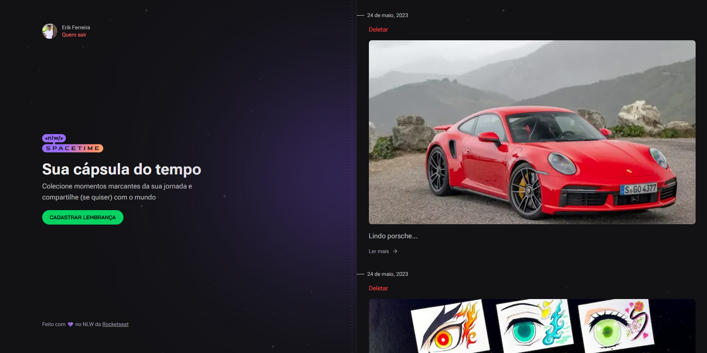

# Nlw Spacetime Ignite

<p>
    
</p>

</p>

## :computer: Projeto

Este foi um projeto desenvolvido durante o Next Level Week da Rocketseat. O objetivo é guardar suas melhores lembranças, como uma cápsula do tempo, onde você pode adicionar um descrição e uma imagem daquele momento.

## :rocket: Tecnologias

- [React](https://reactjs.org)
- [React Native](https://reactnative.dev)
- [Tailwindcss](tailwindcss.com)
- [NextJS](nextjs.org)

## :thinking: Como rodar o projeto?

1. Execute `npm i` para instalar as dependências das 3 partes: server, web e mobile

2. Nas configurações do `github > Developer Settings > OAuth Apps`, crie 2 projetos:

- No Web
  - A homepage URl: `http://localhost:3000`
  - A authorization callback URL: `http://localhost:3000/api/auth/callback`
- No Mobile
  - A homepage URL: `http://localhost:3000`
  - A authorization callback URL: `exp://ip_da_sua_maquina:19000`

3. Crie um arquivo `.env` na pasta server com o seguinte:

```bash
# Database
DATABASE_URL="file:./dev.db"

# Github (Web)
GITHUB_WEB_CLIENT_ID="seu_client_id_do_projeto_web"
GITHUB_WEB_CLIENT_SECRET="seu_client_secret_do_projeto_web"

# Github (Mobile)
GITHUB_MOBILE_CLIENT_ID="seu_client_id_do_projeto_mobile"
GITHUB_MOBILE_CLIENT_SECRET="seu_client_secret_do_projeto_mobile"
```

4. Crie um arquivo `.env.local` na pasta web com o seguinte:

```bash
# Github
NEXT_PUBLIC_GITHUB_CLIENT_ID="seu_client_id_do_projeto_web"
```

5. Agora basta executar:
   5.1 No server: `npm run dev`
   5.2 Na web: `npm run dev`
   5.3 No mobile: `npm run start`
